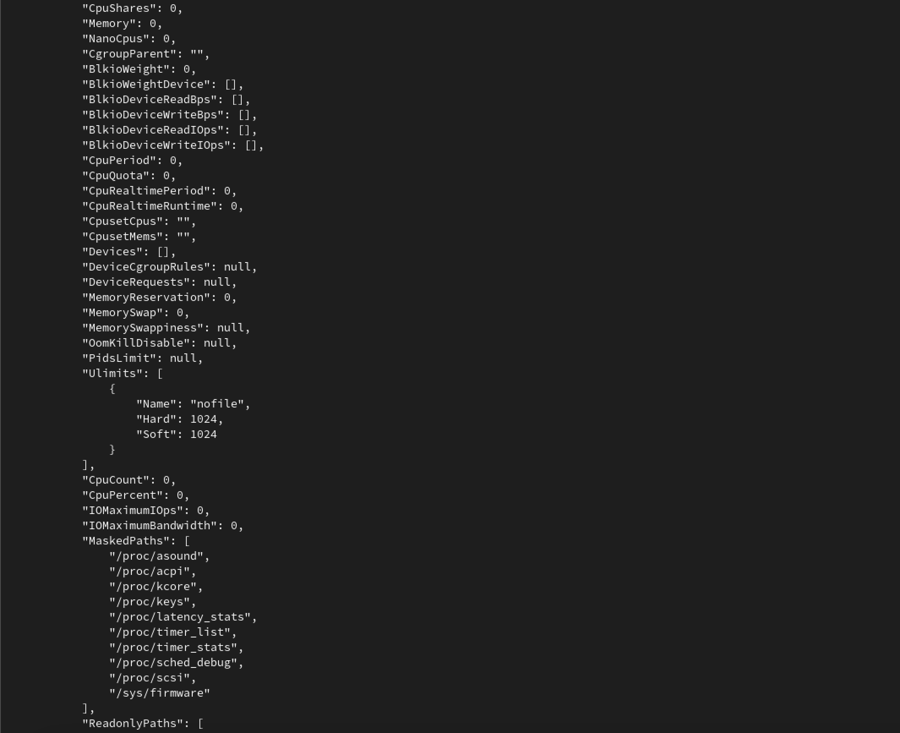
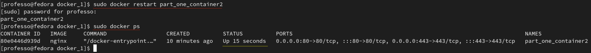

# Simple Docker

## Part 1. Готовый докер

### *`- nginx.`*

**== Задание ==**

1.  Взять официальный докер образ с **nginx** и выкачать его при помощи `docker pull`
2. Проверить наличие докер образа через `docker images`
3. Запустить докер образ через `docker run -d [image_id|repository]`
4. Проверить, что образ запустился через `docker ps`
5. Посмотреть информацию о контейнере через `docker inspect [container_id|container_name]`
6. По выводу команды определить и поместить в отчёт размер контейнера, список замапленных портов и ip контейнера
7.  Остановить докер образ через `docker stop [container_id|container_name]`
8.  Проверить, что образ остановился через `docker ps`
9. Запустить докер с портами 80 и 443 в контейнере, замапленными на такие же порты на локальной машине, через команду *run*
10.  Проверить, что в браузере по адресу *localhost:80* доступна стартовая страница **nginx**
11.  Перезапустить докер контейнер через `docker restart [container_id|container_name]`
12.  Проверить любым способом, что контейнер запустился

*  В отчёт поместить скрины:
	+ Вызова и вывода всех использованных в этой части задания команд;
	+ Стартовой страницы **nginx** по адресу *localhost:80* (адрес должен быть виден).

### Отчет:

> * **`sudo docker pull nginx`** - выкачиваем официальный докер образ с nginx(по умолчанию `:latest`).

  
  
> *  **`sudo docker image`** -  проверяем наличия докер образа.
  
  
  
> *  **`sudo docker run -d --name part_one_container 91582cfffc2d`**- запускаем образ используя *`image id`* (флагом `--name` задаем свое имя)
> *  **`sudo docker ps`**  - проверяем запуск 
  
  

> * **`sudo docker inspect part_one_container`** - смотрим информацию о контейнере 

  
  
  
  
  
  
> * **`sudo docker inspect--size part_one _container | grep -i size`**  
> *`--size`* добавляет информацию о размере контейнера в байтах

  
	
> * **`sudo docker inspect -f '{{.Config.ExposedPorts]}' part_one_container`** *`-f = --format=`* вывод информации об открытых портах  контейнера
> * **`sudo docker inspect part_one_container | grep "\"80/tcp\": {}"`** - выводим только информацию о портах

    

> * **`sudo docker inspect   -f '{{range.NetworkSettings.Networks}}{{.IPAddress}}{{end}}' part_one_container`** - находим ip контейнера 
> * **`sudo docker inspect part_one_container | grep  172.17.0.2`** - выводим только ip контейнера

  

> * **`sudo docker stop part_one_container`** - останавливаем образ используя *container_name*
> * **`sudo docker ps`** - проверяем, что докер образ остановлен.

 
  

> * **`sudo docker run --name part_one_container2 -d -p 80:80 -p 443:443 nginx`** - запускаем докер образ с портами 80 и 443 в контейнере, замапленными на такие же порты на локальной машине 
> * **`sudo docker ps`** - проверяем, что запуск прошел успешно

> * **`xdg-open http://localhost:80`** - в браузере проверям доступ через 80 порт локальной сети к стартовой страничке *`ngnix`*

 

> * **`sudo docker restart part_one_container2`** - перезапускаем докер контейнер используя *`name`*
> * `sudo docker ps` - смотрим что докер контейнер перезапустился

## Part 2. Операции с контейнером

**== Задание ==**

1.   Прочитать конфигурационный файл *nginx.conf* внутри докер контейнера через команду *exec*
2. Создать на локальной машине файл *nginx.conf*
3. Настроить в нем по пути */status* отдачу страницы статуса сервера **nginx**
4. Скопировать созданный файл *nginx.conf* внутрь докер образа через команду `docker cp`
5. Перезапустить **nginx** внутри докер образа через команду *exec*
6. Проверить, что по адресу *localhost:80/status* отдается страничка со статусом сервера **nginx**
7.  Экспортировать контейнер в файл *container.tar* через команду *export*
8.  Остановить контейнер
9. Удалить образ через `docker rmi [image_id|repository]`, не удаляя перед этим контейнеры
10. Удалить остановленный контейнерИмпортировать контейнер обратно через команду *import* 
11. Запустить импортированный контейнер
12. Проверить, что по адресу *localhost:80/status* отдается страничка со статусом сервера **nginx**

- В отчёт поместить скрины:
  - вызова и вывода всех использованных в этой части задания команд;
  - содержимое созданного файла *nginx.conf*;
  - страницы со статусом сервера **nginx** по адресу *localhost:80/status*.

### Отчет:

> * **`sudo docker rename part one_container2 part_two _container`** переименновываем контейнер, для удобства, под *_part 2_*
> * **`sudo docker exec part_two_container cat -n /etc/nginx/nginx.conf | grep .`** - открываем конфигурационный файл внутри контейнера, *(флаг -n и grep . для удобства чтения отчета)*

> * **`sudo nano nginx.conf`** - создаем файл nginx.conf и записываем в него информацию
> * **`cat -n nginx.conf | grep .`** - показываем содержимое файла nginx.conf
> * **`sudo docker cp nginx.conf part_two_container:/etc/nginx/`** - копируем nginx.conf в докер образ
> * **`sudo docker exec part_two container nginx -s reload`** перезапуск nginx (docker exec запускает новую команду в работающем контейнере)

> * **`xdg-open http://localhost:80/status`** открываем localhost:80/status в браузере
> * **`sudo docker ps`** сверяем количество connections.

> * **`sudo docker export -o container.tar part_two_container`** - экспортируем контейнер part_two_container в файл container.tar
> * **`ls`** проверяем наличие файла container.tar

> * **`sudo docker stop part_two_container`** - останавливаем part\_two\_container

> * **`sudo docker rmi -f nginx`** принудительно удаляем образ nginx

> * **`sudo docker rm part_two_container`** удаляем part\_two\_container

> * **`sudo docker import container.tar nginx_restored`** импортируем из файла container.tar

> * **`sudo docker run --name part_two_container_fin -d -p 80:80 -p 443:443 -it nginx_restored sh`** 
> При этом создается и запускается контейнер, названный part\_two\_container\_fin из nginx\_restored образа, с sh оболочкой в ​​качестве основного процесса. Опция -d(сокращение от --detach) запускает контейнер в фоновом режиме в автономном режиме с прикрепленным псевдо-TTY ( -t). Для параметра -i установлено значение «Сохранить STDIN подключение» ( -i), что предотвращает sh немедленный выход процесса.
> * **`sudo docker exec -it part_two_container_fin service nginx start`** запустить nginx и связанные с ним процессы(docker exec запускает новую команду в работающем контейнере.)
> * **`xdg-open http://localhost:8O/status`** открываем localhost:80/status в браузере

## Part 3. Мини веб-сервер

**== Задание ==** 

1. Написать мини сервер на **C** и **FastCgi**, который будет возвращать простейшую страничку с надписью `Hello World!`
2. Запустить написанный мини сервер через *spawn-fcgi* на порту 8080
3. Написать свой *nginx.conf*, который будет проксировать все запросы с 81 порта на *127.0.0.1:8080*
4.  Проверить, что в браузере по *localhost:81* отдается написанная вами страничка
5. Положить файл *nginx.conf* по пути *./nginx/nginx.conf* (это понадобится позже)

> * **`sudo nano hello_world_server.c`**
* **`cat hello_world_server.c | grep .`**

> * **`sudo nano nginx.conf`**
* **`cat nginx.conf | grep .`**

> * **`sudo docker run --name part_3_container -d -p 81:81 nginx`**
* **`sudo docker ps`**

> * **`sudo docker cp nginx.conf part_3_container:/etc/nginx/`**
* **`sudo docker cp hello_world_server.c part_3_container:/home/`**

> * **`sudo docker exec -t -i part_3_container /bin/bash`**
* **`apt-get update`**

> * **`apt install gcc libfcgi-dev spawn-fcgi`**

> * **`cd /home/`**
* **`ls`**
* **`gcc -o miniserver_hello_world hello_world_server.c -lfcgi`**
* **`ls`**

> * **`spawn-fcgi -a 127.0.0.1 -p 8080 ./miniserver_hello_world`**

> * **`nginx -s reload`** || **`nginx`**
* **`exit`**
* **`xdg-open http://localhost:81`**

* `make run_part_3` собирает и запускает мини веб-сервер с помощью скриптов

## Part 4. Свой докер 

* `make run_part_4`собирает и запускает мини веб-сервер с помощью Докерфайла и скриптов

## Part 5. **Dockle**

* `make run_part_5`собирает, запускает  и проверяет мини веб-сервер с помощью Докерфайла, скриптов и dockle

## Part 6. Базовый **Docker Compose**

* `make run_part_6` собирает, запускает  и проверяет мини веб-сервер с помощью docker-compose, скриптов и Докерфайла

