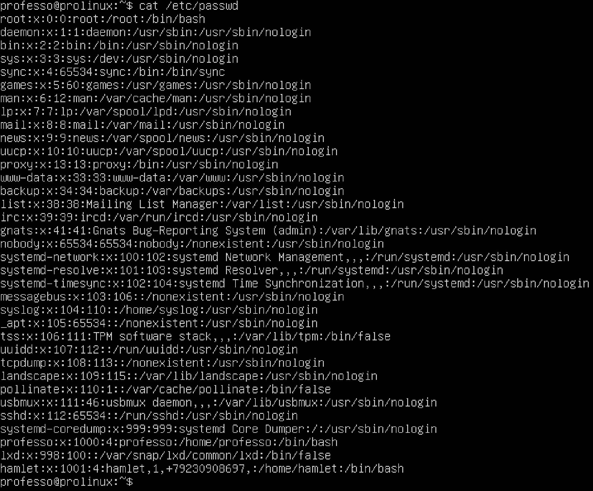
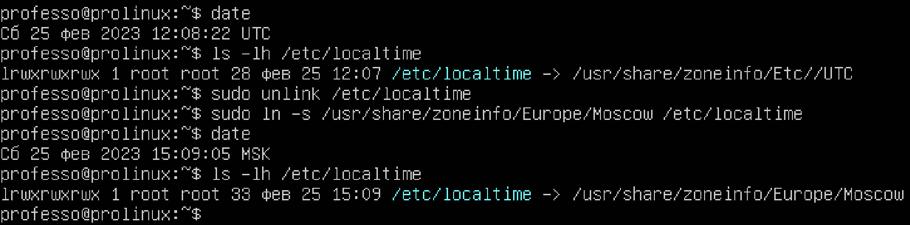
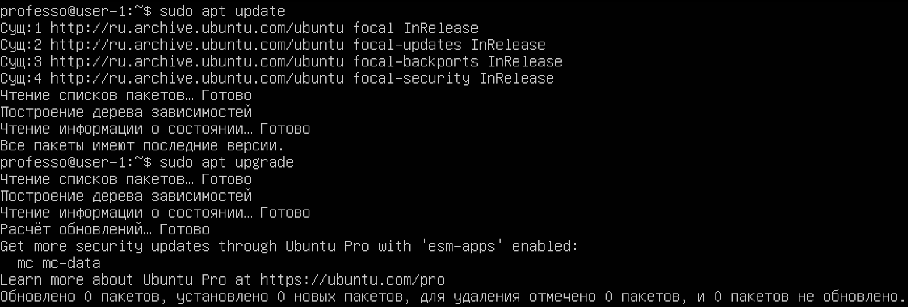
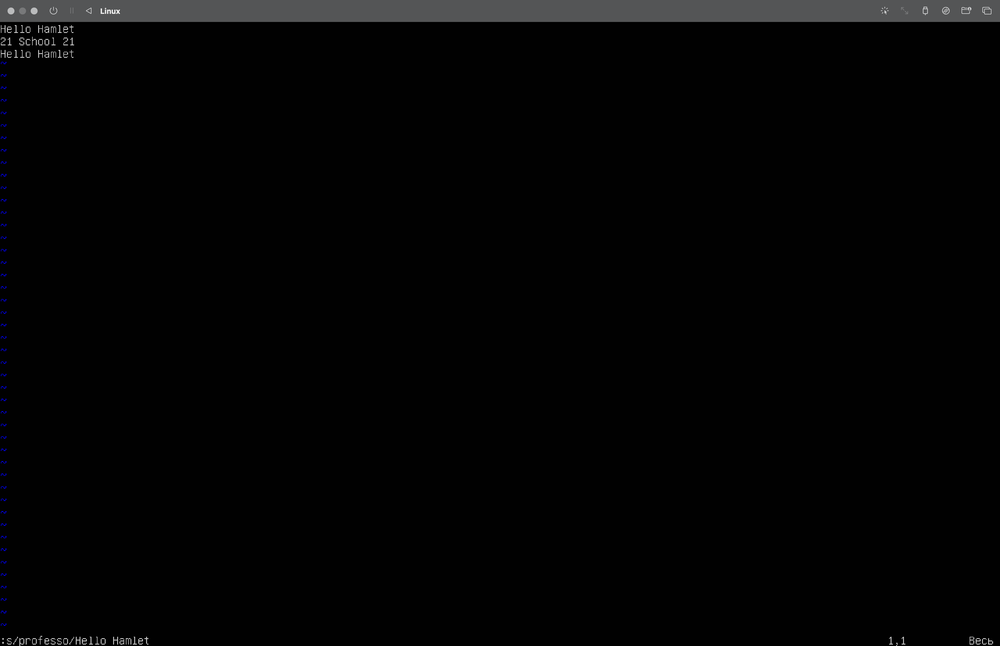
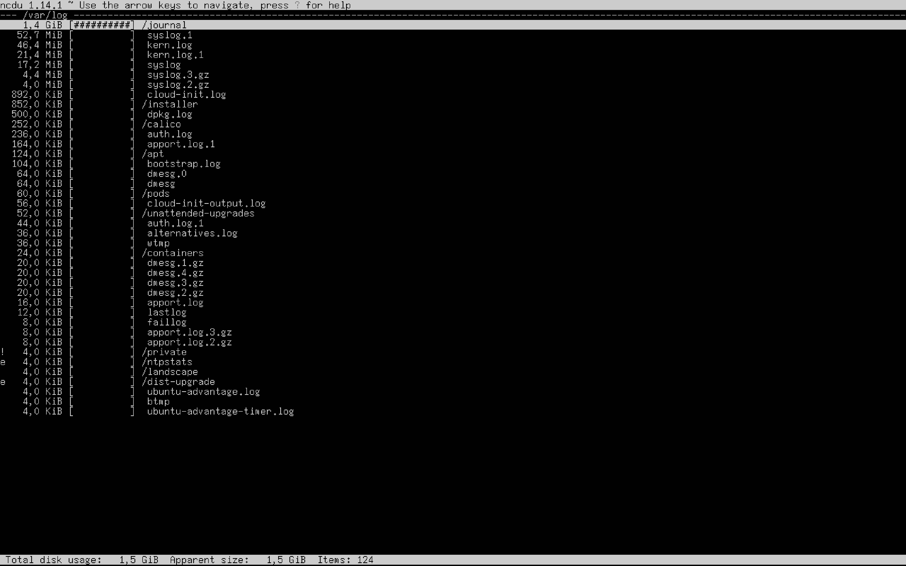
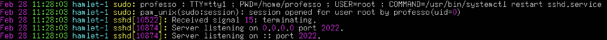

## Part 1. Установка ОС

* Графический интерфейс должен отсутствовать. (Используем программу для виртуализации - VirtualBox) *использовал UTM, т.к. VirtualBox не смогла запустить Ubuntu 20.04 Server LTS, процессор М1.*
* Узнайте версию Ubuntu, выполнив команду **cat /etc/issue**. 
*etc - oсновной каталог конфигурационных файлов системы.*
* Cкриншот с выводом команды **cat /etc/issue**.

	

## Part 2. Создание пользователя

 * Посмотреть список пользователей можно с помощью команды  **cat /etc/passwd** (или отфильтровав лишнюю информацию **sed 's/:.*//' /etc/passwd**)
 

	

* Создаем нового пользователя *hamlet* с помощью команды **sudo adduser hamlet**

	

	 

* Добавляем пользователя *hamlet* в группу *adm* командой **sudo usermod -g adm hamlet** (флаг -g нужен чтобы добавить пользователя в основную группу, одной из которых и является группа adm.) Можно создать пользователя, *hamlet*, сразу с добавлением в группу *adm*, командой **sudo useradd -g adm hamlet**.
	
* Скриншот с выводом команды **cat /etc/passwd**(4 = adm)

	

## Part 3. Настройка сети ОС

* Задать название машины вида user-1 (использовал команду **sudo hostnamectl set-hostname user-1**) *hostnamectl* может использоваться для запроса и изменения системного имени хоста и связанных с ним настроек(*hostnamectl* является частью *systemd* и предоставляет надлежащий **API** для работы с настройкой имен хостов сервера стандартизированным способом.)

	

* Установить временную зону, соответствующую вашему текущему местоположению. 
       1.  Командой **date** просматриваем текущие данные 
       2.  Печатаем содержимое каталога **ls -lh /etc/localtime**
       3.  Удаляем указанный файл **sudo unlink /etc/localtime**
       4.  Записываем новые данные **ln -s /usr/share/zoneinfo/Europe/Moskow /etc/localtime**    

	

* Вывести названия сетевых интерфейсов с помощью консольной команды.
       *  Компактный вариант  **ip -br link show** (скриншот)
       *  Более полный **ip link show**
 

	

  * **lo**(*Loopback*) интерфейс используется для связи программ IP-клиентов с IP-серверами, запущенными на одной машине(пк) т.е. это специальный виртуальный сетевой интерфейс , который компьютер использует для связи с самим собой. Он используется в основном для *диагностики* и *устранения неполадок*, а также для *подключения к серверам, работающим на локальном компьютере*.
 
*  Используя консольную команду получить ip адрес устройства, на котором вы работаете, от DHCP сервера(**ip -br addr**).

	

 * **DHCP** - протокол динамической конфигурации узлов (*Dynamic Host Configuration Protocol*) — это сетевой протокол, используемый для автоматического получения узлами IP-адресов и сетевой конфигурации с сервера.

* Определить и вывести на экран внешний ip-адрес шлюза (ip) и внутренний IP-адрес шлюза, он же ip-адрес по умолчанию (gw).

	

* Задать статичные (заданные вручную, а не полученные от DHCP сервера) настройки ip, gw, dns (использовать публичный DNS серверы, например 1.1.1.1 или 8.8.8.8).

  1.  проверяем наличие файла *.yaml*  **ls -l /etc/netplan/**
  2.  узнаем информацию о сети **ip -br addr** (у меня это enp0s1 192.168.64.6/24)
  3.  редактируем файл **sudo vim /etc/netplan/name.yaml** и сохраняем **:wq**
  4.  применяем настройки **sudo netplan try** вводим и пароль,нажимем ENTER 
  5. смотрим файл **cat /etc/netplan/name.yaml** (скриншот)

	

   
* Перезагрузить виртуальную машину. Убедиться, что статичные сетевые настройки (ip, gw, dns) соответствуют заданным в предыдущем пункте.  

 
  1.  перезагружаем VM **reboot** 
  2.  проверяем файл **cat /etc/netplan/name.yaml**, все ОК.(скриншот)
  

	

  
  * Успешно пропинговать удаленные хосты 1.1.1.1 и ya.ru и вставить в отчёт скрин с выводом команды. В выводе команды должна быть фраза "0% packet loss".(скриншот)
  

	

  
  
## Part 4. Обновление ОС

* Обновить системные пакеты до последней на момент выполнения задания версии.
  - обновить список пакетов **sudo apt update**
  - обновить установленные пакеты  **sudo apt upgrade** 
  - скриншот с сообщением что обновления отсутствуют 
  

	

  
## Part 5. Использование команды sudo

* Разрешить пользователю, созданному в Part 2, выполнять команду sudo.
  * добавляем пользователя *hamlet* в группу **sudo usermod -aG sudo hamlet** 
  * смена пользователя **su hamlet**
  * меняем *hostname*  от имени пользователя *hamlet* **sudo hostnamectl set-hostname hamlet-1**
  * скрин с измененным *hostname*
  

	

  
  * sudo это утилита семейста ОС Linux которая позволяет запускать программы от имени других пользователей, а также от имени суперпользователя.
  
## Part 6. Установка и настройка службы времени

* Настроить службу автоматической синхронизации времени.
  * **sudo apt update** -> **sudo apt install ntpdate**
  * **sudo ntpdate pool.ntp.org** 
  * **timedatectl show** (скриншот)
  

	

  
  
##   Part 7. Установка и использование текстовых редакторов

* Установить текстовые редакторы VIM (+ любые два по желанию NANO, MCEDIT, JOE и т.д.)

 - Установить текстовый редактор *VIM*  **sudo apt install vim** 
 - Установить текстовый редактор *NANO* **sudo apt install nano** 
 - Установить текстовый редактор *JOE*  **sudo apt install joe**
 
* Используя каждый из трех выбранных редакторов, создайте файл test_X.txt, где X -- название редактора, в котором создан файл. Напишите в нём свой никнейм, закройте файл с сохранением изменений.
 - Создаю текстовый файл *test\_vim.txt* в *VIM*: **sudo vim test\_vim.txt** (i для редактирования, ESC -> :wq -> ENTER, выйти с сохранением)

	

 
 - Создаю текстовый файл *test\_nano.txt* в *NANO*: **sudo nano test\_nano.txt** ( CTRL + X - Y --> ENTER, выйти с сохранением)

	

 
 - Создаю текстовый файл *test\_joe.txt* в *JOE*: **sudo nano test\_joe.txt** ( CTRL + K - X, выйти с сохранением)
 

	

 
* Используя каждый из трех выбранных редакторов, откройте файл на редактирование, отредактируйте файл, заменив никнейм на строку "21 School 21", закройте файл без сохранения изменений.

 - Открываю текстовый файл *test\_vim.txt* в *VIM*: **sudo vim test\_vim.txt** (i для редактирования, ESC --> :q! --> ENTER, выйти без сохранения)
 

	

 
 - Открываю текстовый файл *test\_nano.txt* в *NANO*: **sudo nano test\_nano.txt** ( CTRL + X - N, выйти без сохранения)

	

 
 - Создаю текстовый файл *test\_joe.txt* в *JOE*: **sudo nano test\_joe.txt** ( CTRL + C --> Y, выйти без сохранения)

	

 
 
* Используя каждый из трех выбранных редакторов, отредактируйте файл ещё раз (по аналогии с предыдущим пунктом), а затем освойте функции поиска по содержимому файла (слово) и замены слова на любое другое.

 - Открываю текстовый файл *test\_vim.txt* в *VIM*: **sudo vim test\_vim.txt** (добавил строки для поиска и замены, ESC  --> /Hamlet, для поиска слова)
 

	

 
 - для поиска и замены: :s/professo/Hello Hamlet  --> ENTER
 

	

 
 - Открываю текстовый файл *test\_nano.txt* в *NANO*: **sudo nano test\_nano.txt** (добавил строки для поиска и замены, CTRL + W, ввожу искомое слово  -->  ENTER)

	

 
 - для поиска и замены: CTRL + \ --> professo*(заменяемое)* --> ENTER --> Hello Hamlet*(заменитель)* --> ENTER --> Y(столько раз сколько найдено совпадений)

	

 
 - Открываю текстовый файл *test\_joe.txt* в *JOE*: **sudo nano test\_joe.txt** (добавил строки для поиска и замены, CTRL + K - F --> Hamlet --> ENTER --> b(если искать назад от положения курсора) --> ENTER)

	

 
 - для поиска и замены: CTRL + K - F --> professo*(заменяемое)* --> ENTER --> R(поиск с заменой вперед), RB(поиск с заменой назад) --> ENTER --> Hello Hamlet*(заменитель)* --> ENTER --> Y)

	

 
 
## Part 8. Установка и базовая настройка сервиса SSHD
 
* Установить службу SSHd
	- Установка клиентских и серверных приложений OpenSSH: **sudo apt install openssh-server**
* Добавить автостарт службы при загрузке системы
	-  **sudo systemctl enable sshd**
* Перенастроить службу SSHd на порт 2022.
	- **sudo vim /etc/ssh/sshd_config** 
	- изменил порт c 22 на 2022
* Используя команду ps, показать наличие процесса sshd. Для этого к команде нужно подобрать ключи.

	- **ps** используется для отображения текущих запущенных процессов и отображения информации об этих процессах
	
		* **-A**, **-e**, (a) - выбрать все процессы;
		* **-a** - выбрать все процессы, кроме фоновых;
		* **-d**, (g) - выбрать все процессы, даже фоновые, кроме процессов сессий;
		* **-N** - выбрать все процессы кроме указанных;
		* **-С** - выбирать процессы по имени команды;
		* **-G** - выбрать процессы по ID группы;
		* **-p**, (p) - выбрать процессы PID; 
		* **--ppid** - выбрать процессы по PID родительского процесса;
		* **--s** - выбрать процессы по ID сессии;
		* **-t**, (t) - выбрать процессы по tty;
		* **-u**, (U) - выбрать процессы пользователя.
		* **-с** - отображать информацию планировщика;
		* **-f** - вывести максимум доступных данных, например, количество потоков;
		* **-F** - аналогично -f, только выводит ещё больше данных;
		* **-l** - длинный формат вывода;
		* **-j**, (j) - вывести процессы в стиле Jobs, минимум информации;
		* **-M**, (Z) - добавить информацию о безопасности;
		* **-o**, (o) - позволяет определить свой формат вывода;
		* **--sort**, (k) - выполнять сортировку по указанной колонке;
		* **-L**, (H)- отображать потоки процессов в колонках LWP и NLWP;
		* **-m**, (m) - вывести потоки после процесса;
		* **-V**, (V) - вывести информацию о версии;
		* **-H** - отображать дерево процессов;

	- Скриншот c выполненной командой **ps -C sshd**
	

	

* Перезагрузить систему(**reboot**).

	- **-tan** (-t -a -n)
	
		* **-t** показывает только tcp соединения.
		* **-a** выводит список всех портов и соединений независимо от их состояния или протокола.
		* **-n** показать адреса, как числа.
	- значение каждого столбца вывода, значение 0.0.0.0.
    	* *Proto* - протокол, используемый сокетом; 
    	* *Recv-Q* - Счётчик байт не скопированных программой пользователя из этого сокета;
    	* *Local Address* - локальный адрес (имя локального хоста) и номер порта сокета;
    	* *Foreign Address* - удаленный адрес (имя удаленного хоста) и номер порта сокета 
    	* *State* - состояние сокета 0.0.0.0:* любой локальный адрес:номер портa, LISTEN -  что служба прослушивает запросы;
	- Скриншот c выполненной командой **netstat -tan**
 

	

## Part 9. Установка и использование утилит top, htop

* Установить и запустить утилиты top и htop.
	- uptime = 23 min
	- количество авторизованных пользователей = 1
	- общую загрузку системы = 6,26(626%)
	- общее количество процессов = 239
	- загрузку cpu = 100
	- загрузку памяти = 1671,7
	- pid процесса занимающего больше всего памяти = 92825
	- pid процесса, занимающего больше всего процессорного времени = 92825
* В отчёт вставить скрины с выводом команды htop
	- *отсортированному* по PID, PERCENT_CPU, PERCENT_MEM, TIME

		* **htop -s PID**
		* **htop -s PERCENT_CPU**
		* **htop -s PERCENT_MEM**
		* **htop -s TIME**
		* Или запустив приложение: **F6** и выбрать значение в колонке слева, ENTER; 

			
			
			
			
			
	- *отфильтрованному* для процесса sshd
	
		* запустив приложение: **F4** и ввести sshd, ENTER; 
			
			
			
	- с процессом syslog, *найденным*, используя поиск
		
		* запустив приложение: **F3** и ввести syslog, ENTER;
			
			
 	
 	- с добавленным выводом *hostname, clock и uptime*
 		
 		* запустив приложение: **F2**(настройки) и добавить *hostname, clock и uptime*.
 			
 			
 			
## Part 10. Использование утилиты fdisk

* Запустить команду **fdisk -l**.
	- название жесткого диска: QEMU HARDDISK;
	- размер: 64Gb;
	- количество секторов: 134217729;
	- размер swap: 3.8Gb;

	

## Part 11. Использование утилиты df

* Запустить команду **df**.
	- размер раздела: 31270768
	- размер занятого пространства: 13149896
	- размер свободного пространства: 16506844
	- процент использования: 45%
	

	

* единица измерения в выводе: 1K-blocks(kb)

* Запустить команду **df -Th**.
	- размер раздела: 30G
	- размер занятого пространства: 13G
	- размер свободного пространства: 16G
	- процент использования: 45%

	

* тип файловой системы для раздела: ext4.

## Part 12. Использование утилиты du
* Запустить команду du.

* Вывести размер папок /home, /var, /var/log (в байтах, в человекочитаемом виде)

	

 
* Вывести размер всего содержимого в /var/log (не общее, а каждого вложенного элемента, используя *)

	

## Part 13. Установка и использование утилиты ncdu

* Установить утилиту ncdu.
	- **sudo apt install ncdu**

* Вывести размер папок /home, /var, /var/log.

	- /home

	

		
	

	- /var

	

		
	

	
	- /var/log

	

		
	

## Part 14. Работа с системными журналами
* Открыть для просмотра:

	- время последней успешной авторизации: 11:26:35
	- имя пользователя: professo
	- метод входа в систему: tty1

	

* Перезапустить службу SSHd.
	- **sudo systemctl restart sshd**

	

	

## Part 15. Использование планировщика заданий CRON

* Используя планировщик заданий, запустите команду uptime через каждые 2 минуты.
 	- * /2 * * * * uptime

* Найти в системных журналах строчки (минимум две в заданном временном диапазоне) о выполнении.
Вывести на экран список текущих заданий для CRON.
Вставить в отчёт скрины со строчками о выполнении и списком текущих задач.

	

	

* Удалите все задания из планировщика заданий.
	- **sudo crontab -r**

	

	

