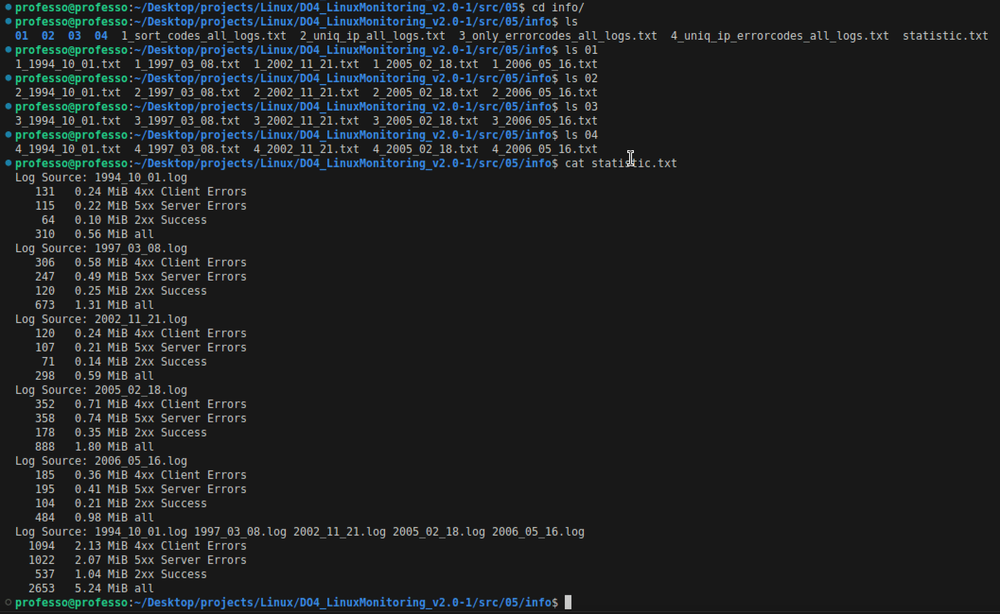

# Part 6

##Goaccess

GoAccess is an open source real-time web log analyzer and interactive viewer

* **goaccess [filename] [options...] [-c][-M][-H][-q][-d][...]**

> The screenshot shows the result of executing the script from the fifth part of the project. Folders whose names match the argument entered when running the script. The **`statistic.txt`** file displays information on each *log* separately and and general information about *all logs*.

### Terminal Output:

>   goaccess --sort-panel=BY_VISITORS --ignore-panel=GEO_LOCATION 
    --ignore-panel=KEYPHRASES --ignore-panel=REQUESTS_STATIC 
    --ignore-panel=REFERRING_SITES -a  --4xx-to-unique-count  -f ../04/logs/*.log
    

    

### HTML Output 

>    sudo  goaccess --enable-panel=STATUS\_CODES 
    --enable-panel=STATUS\_CODES --sort-panel=BY_VISITORS 
    --ignore-panel=GEO\_LOCATION  --ignore-panel=KEYPHRASES 
    --ignore-panel=REQUESTS\_STATIC --ignore-panel=REFERRING\_SITES-f 
    ../04/logs/*.log --log-format=COMBINED -o goaccess\_report.html

