# PART 7

### Installing  Prometheus on Ubuntu 20.04
* `sudo apt update`
* `sudo apt install prometheus`
* `sudo systemctl start prometheus`
* `sudo systemctl enable prometheus`
* `systemctl status prometheus`
* `http://localhost:9090`

	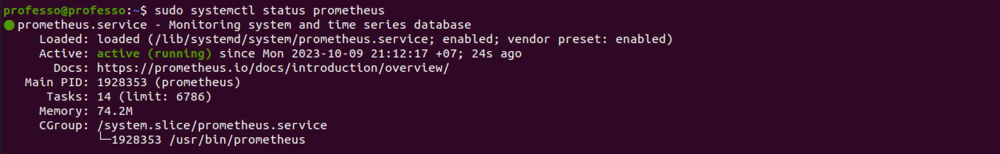

### Installing Grafana on Ubuntu 20.04

1. **Installing Grafana**
	* `wget -q -O - https://packages.grafana.com/gpg.key | sudo apt-key add -`
	* `sudo add-apt-repository "deb https://packages.grafana.com/oss/deb stable main"`
	* `sudo apt update`
	* `sudo apt install grafana`
	* `sudo systemctl enable grafana-server`
	* `sudo systemctl start grafana-server`
	* `sudo systemctl status grafana-server`
	
	**or**
	
	* `wget https://dl.grafana.com/oss/release/grafana_9.2.4_amd64.deb`
	`wget https://dl.grafana.com/oss/release/grafana_9.2.4_arm64.deb` *(APPLE M1 or M2)*
	* `sudo dpkg -i grafana_9.2.4_amd64.deb && \ sudo systemctl enable grafana-server && sudo systemctl 		start grafana-server`
	`sudo dpkg -i grafana_9.2.4_arm64.deb && \ sudo systemctl enable grafana-server && sudo systemctl start 		grafana-server`*(APPLE M1 or M2)*

	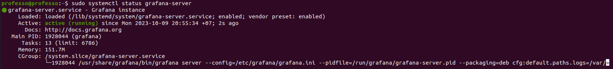

2. **`http://localhost:3000`**
	* 	`admin - admin`
	*  change password

### Dashboards

1. 
	* 	**CPU**
	
		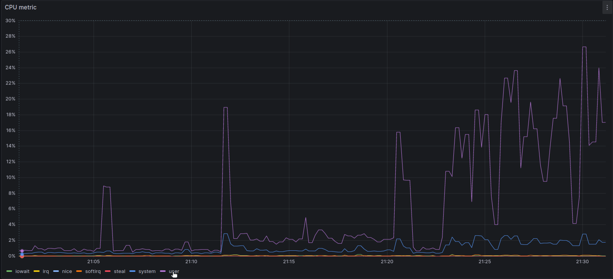
	
	* 	**Free Space RAM**
	
		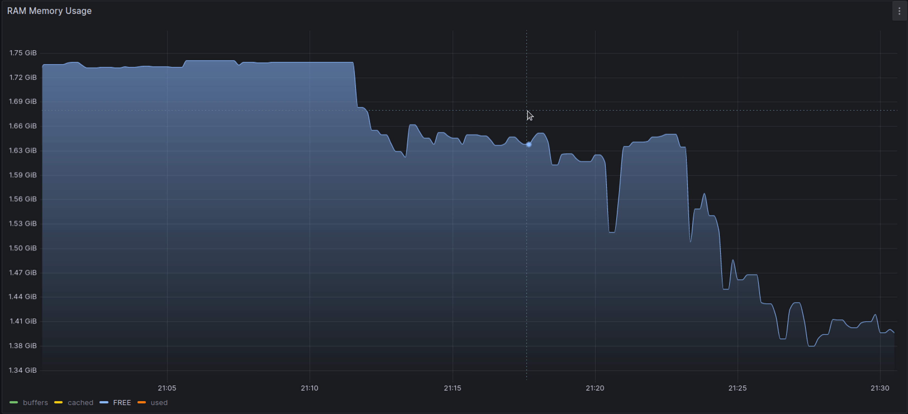
		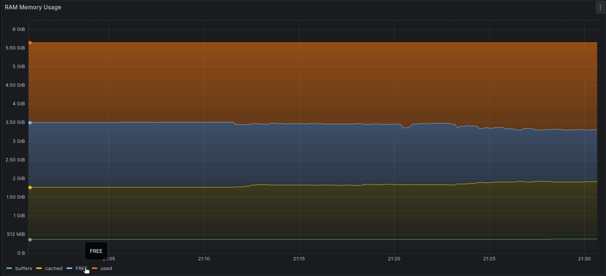
	* **I/O Disk**

		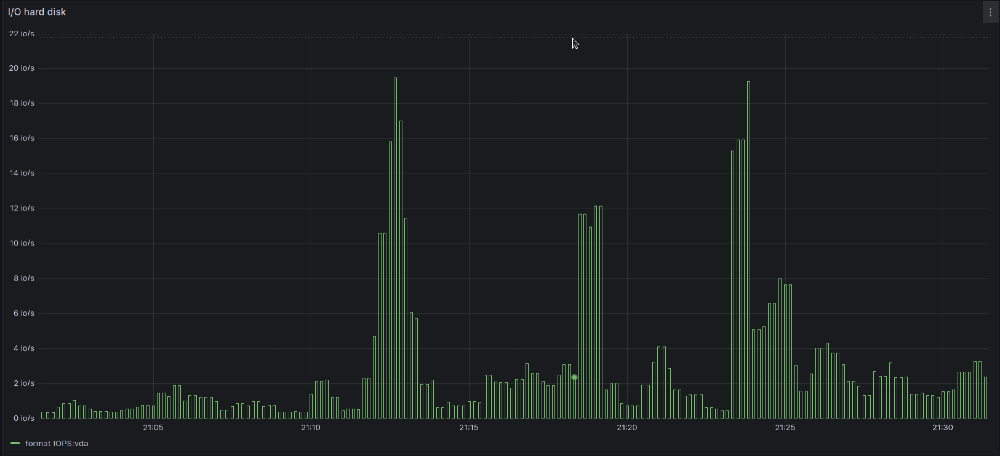
	
	* **Free and used hard disk space**

		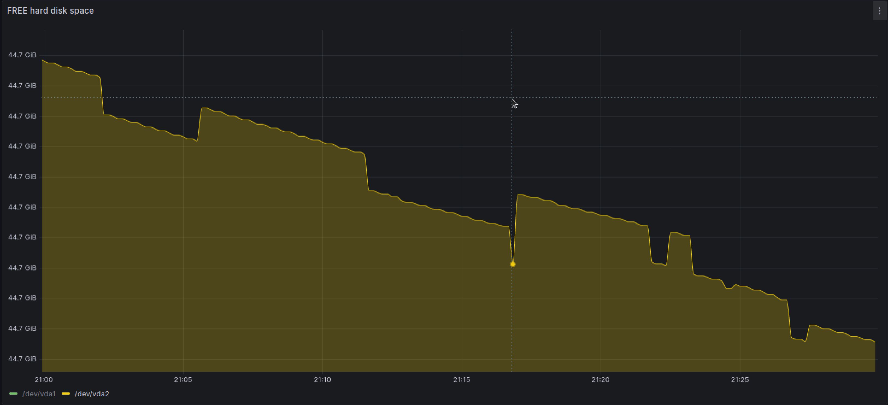
		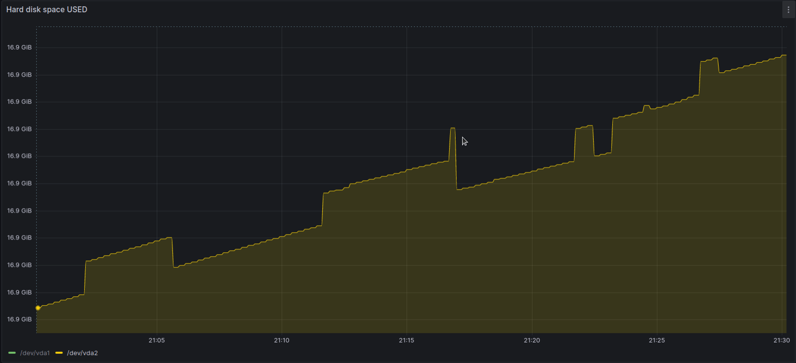

4. **Test PART_2**
		
	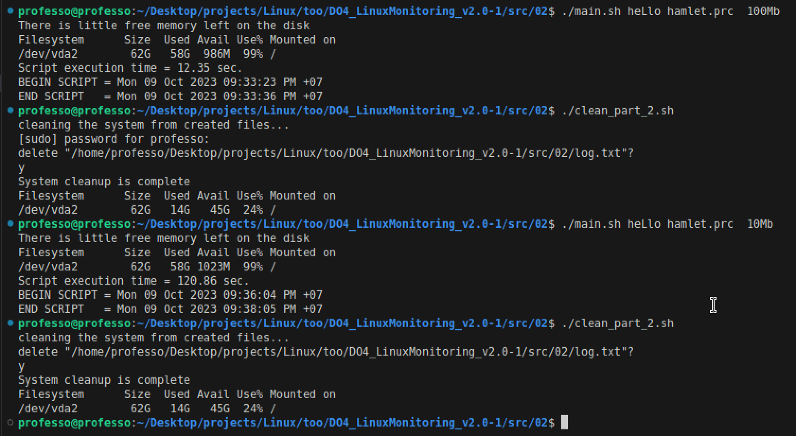
	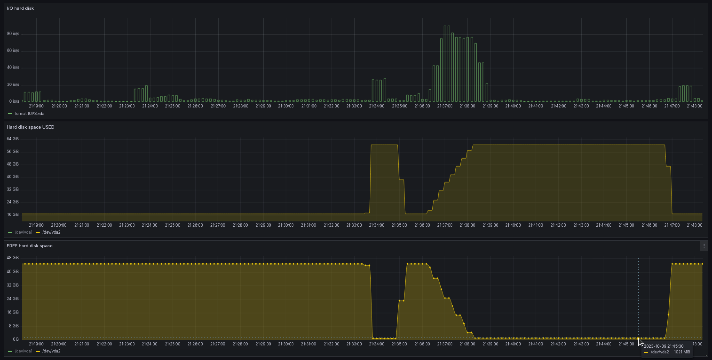

5. **Stress test**

	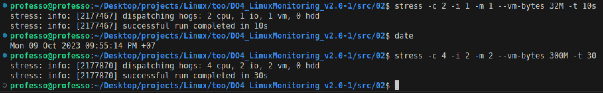
	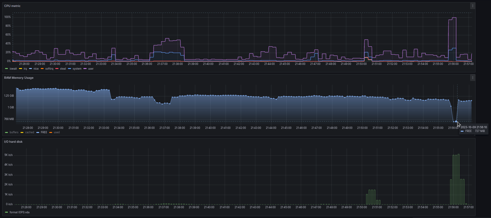

### Access the Prometheus and Grafana web interfaces from a local machine

* `ssh -fnNT -L 9090:127.0.01:9090 -L 3000:127.0.0.1:3000 username@ip`
* `port forwarding`