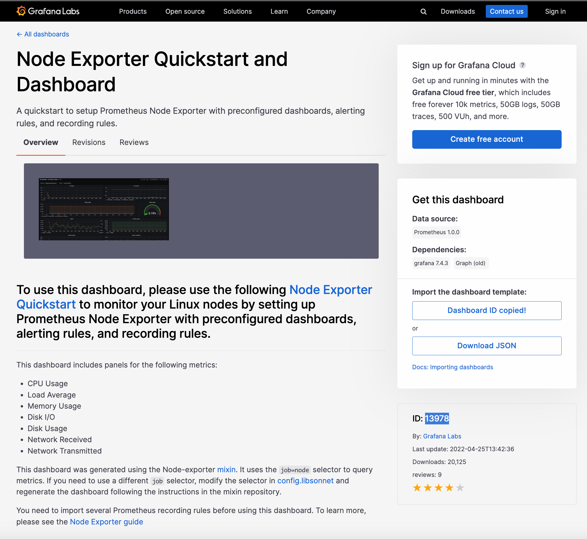
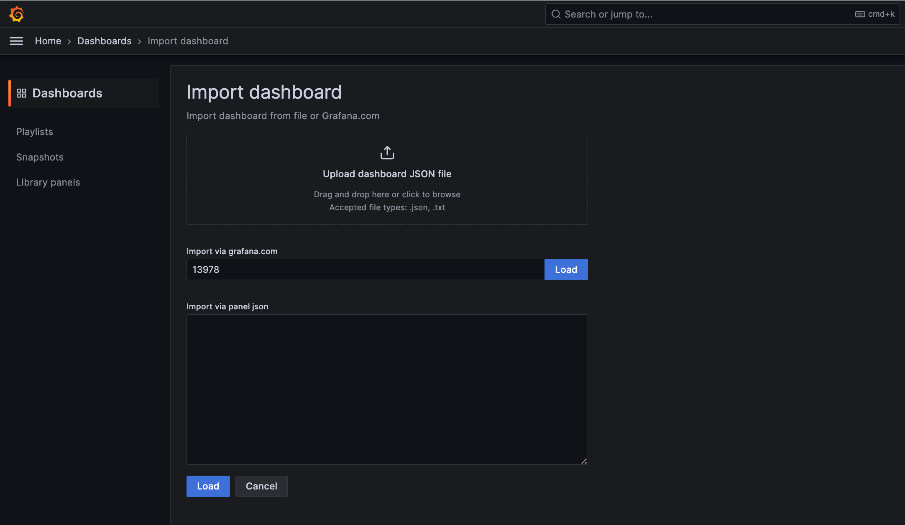
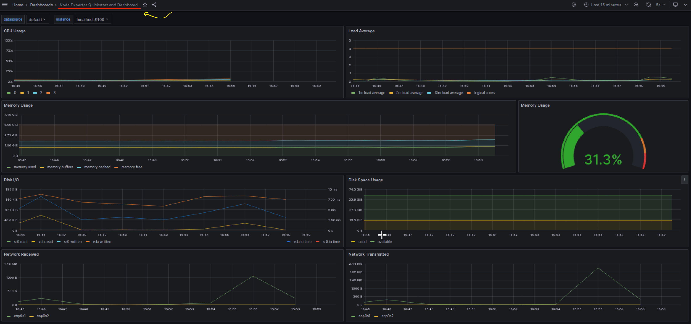
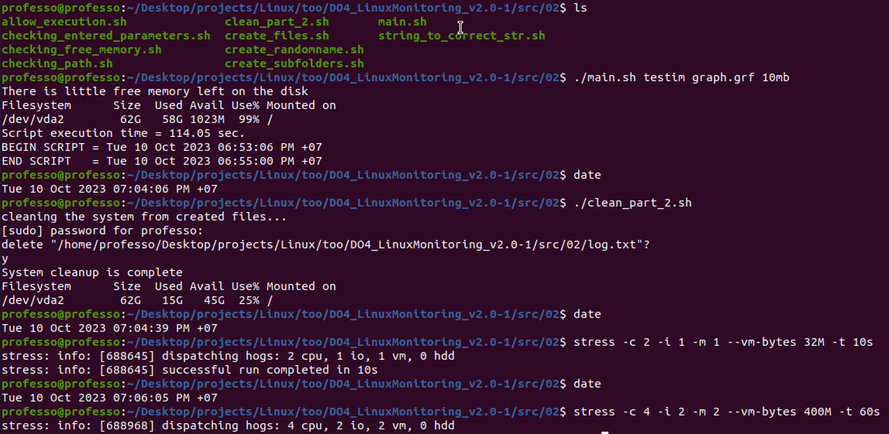
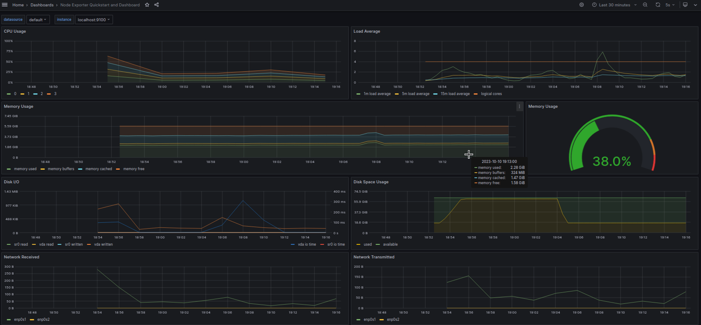
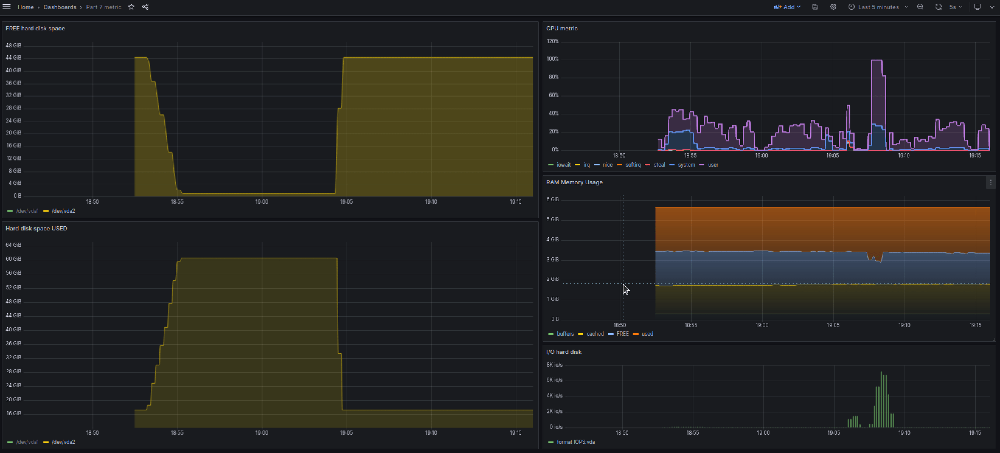
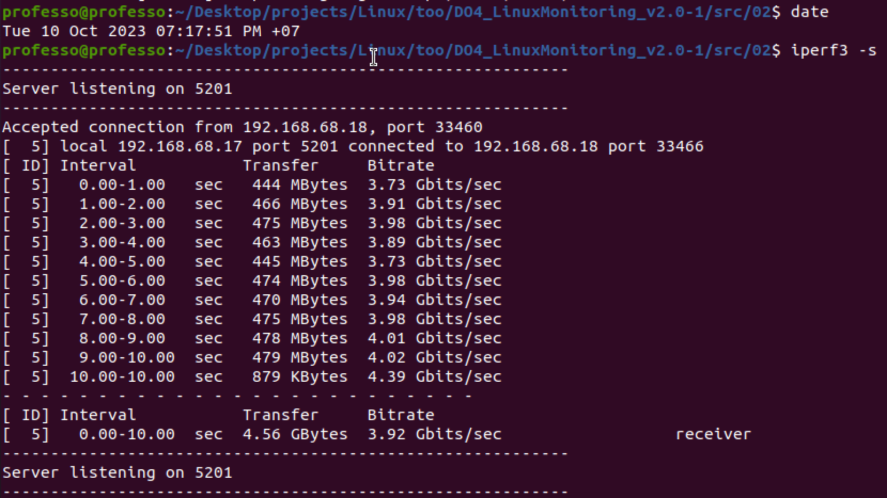
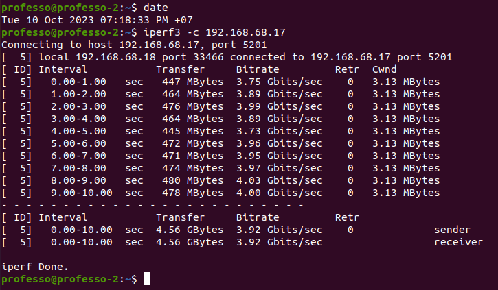
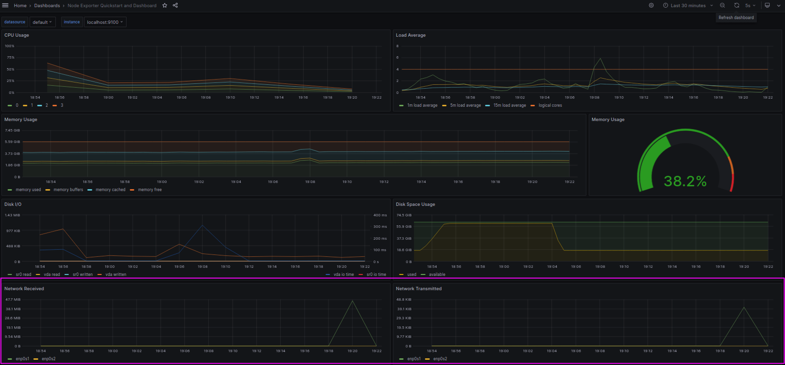
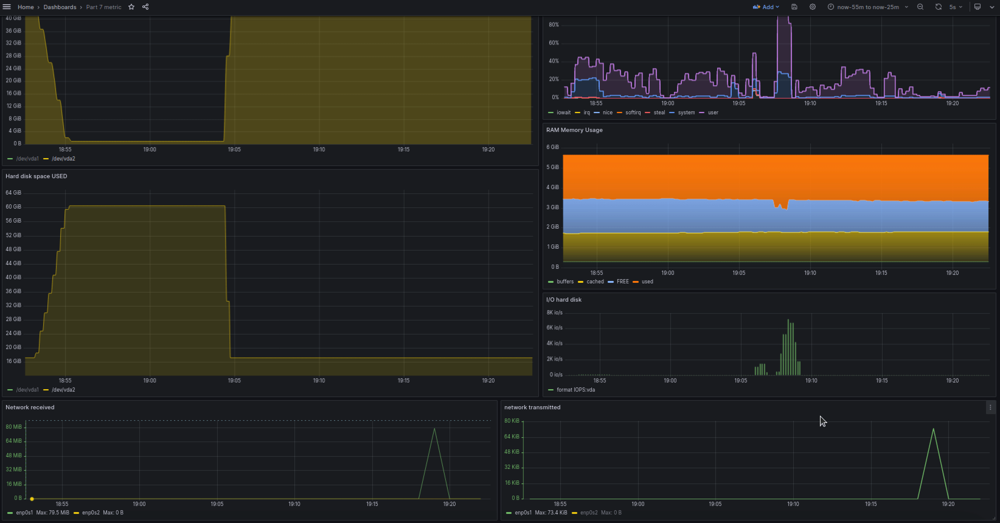

# Part 8

#### How to install Prometheus Node Exporter on Ubuntu 20.04

* [Install Prometheus Node Exporter on Ubuntu 20.04](https://ourcodeworld.com/articles/read/1686/how-to-install-prometheus-node-exporter-on-ubuntu-2004)

#### Download the ready-made dashboard Node Exporter Quickstart and Dashboard from Grafana Labs official website.

* [official website](https://grafana.com/grafana/dashboards/13978-node-exporter-quickstart-and-dashboard/)

	
	
	

#### Tests
`Run script from part 2 and stress test`

`Node Exporter Quickstart and Dashboard `

`My Dashboard from part 7`

`iperf3`

wm-1

wm-2

`Node Exporter Quickstart and Dashboard `

`My Dashboard from part 7 + network`

