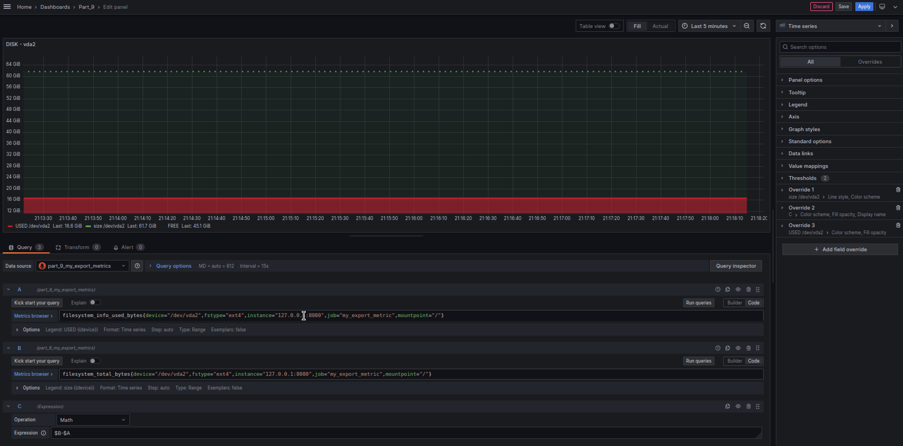

## Part 9. Bonus. Your own *node_exporter*

### Requirements: 
* ***linux ubuntu 20.04***
* ***installed Prometheus***
* ***installed Node Exporter***
* ***installed Grafana***
* ***installed Nginx***

### The script collects the basic metrics of the system (CPU, RAM, hard disk (capacity)).

* **Add to the prometheus file.yml the following lines.**

	

* **Nginx.conf**

	
	
* **This is an example of a generated html page**
	
	
	
* **Dashboards** 
	
	
	
	* **CPU**
	
		
		
	* **RAM**
	
		
		
	* **HARD DISK**
	
		
	
* **tests**

	
	
	* **test part 2 (hdd)**
	
		
		
	* **stress test**
		
		

* **./main.sh** 
  * *Metrics are updated every 3 seconds.*(sleep 3) 
  * Almost all metrics are taken from the directory /proc
  *  	 */proc directory is not a real filesystem, it is a Virtual File System. It contains information about processes and other system information. It is mapped to /proc and mounted at boot time.*