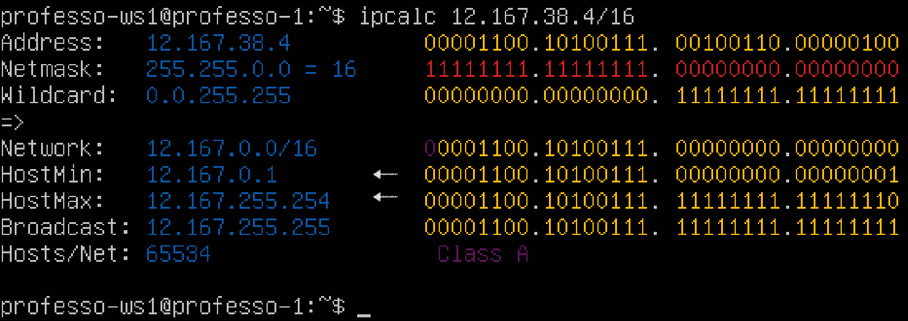
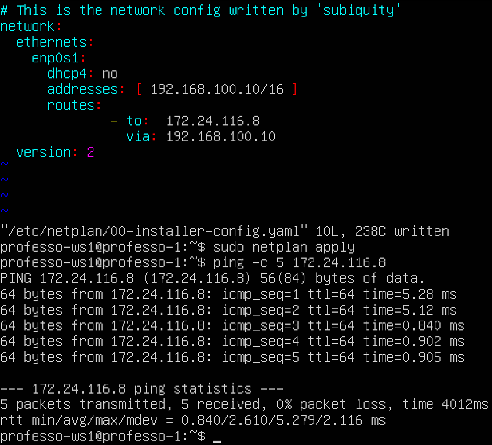
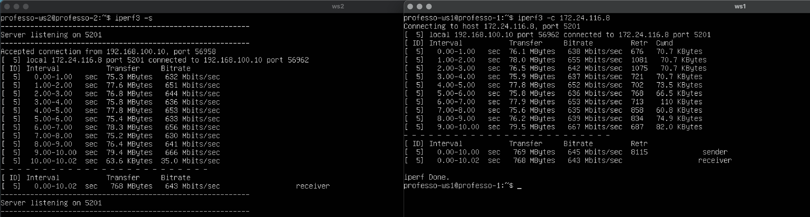
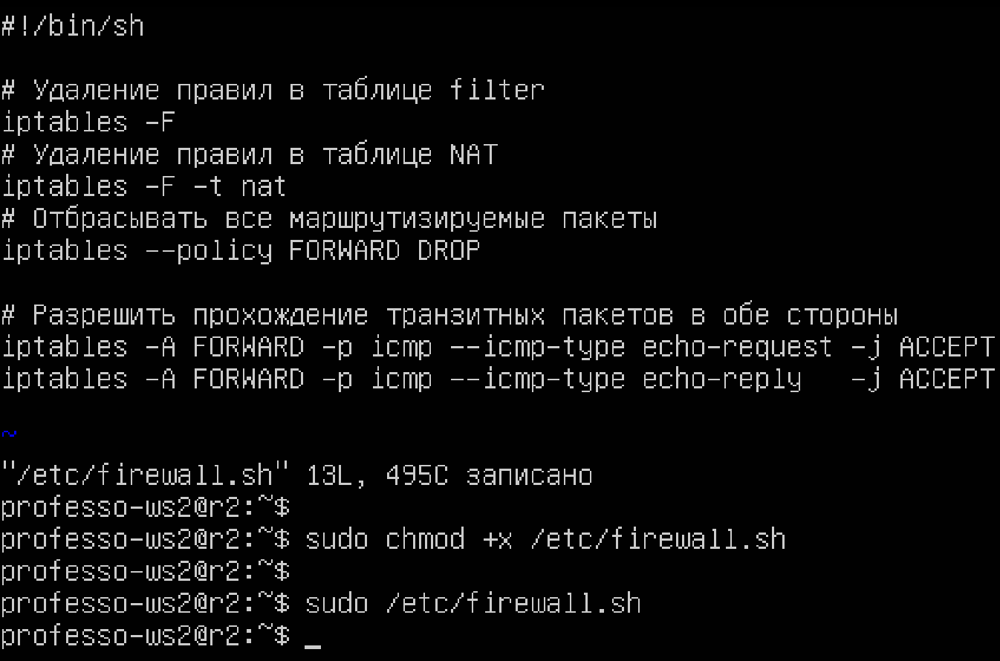
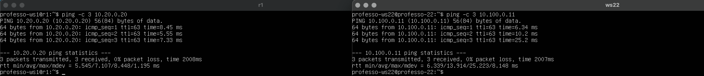
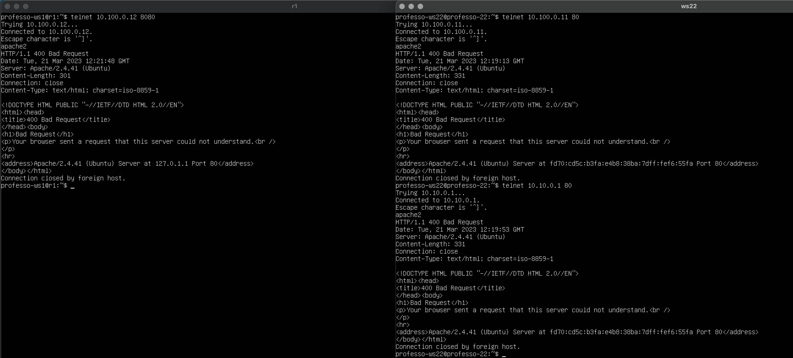

# Сети в Linux


***

1. [Part 1. **Инструмент ipcalc**](#part-1-инструмент-ipcalc) 
2. [Part 2. **Статическая маршрутизация между двумя машинами**](#part-2-статическая-маршрутизация-между-двумя-машинами) 
3. [Part 3. **Утилита iperf3**](#part-3-утилита-iperf3) 
4. [Part 4. **Сетевой экран**](#part-4-сетевой-экран)
5. [Part 5. **Статическая маршрутизация сети**](#part-5-статическая-маршрутизация-сети)
6. [Part 6. **Динамическая настройка IP с помощью DHCP**](#part-6-динамическая-настройка-ip-с-помощью-dhcp)
7. [Part 7. **NAT**](#part-7-nat)
8. [Part 8. **SSH-Tunnels**](#part-8-дополнительно-знакомство-с-ssh-tunnels)

***

## Part 1. Инструмент ipcalc

* Поднять виртуальную машину (--ws1)


* #### 1.1. Сети и маски

	- установить *ipcalc*: `sudo apt install ipcalc`
	
	- адрес сети `192.167.38.54/13` 
	
	<center>
		
	</center>

	- перевод маски `255.255.255.0` в префиксную и двоичную запись
		* *префиксная* = `/24`
		* *двоичная* = `11111111.11111111.11111111.00000000`
		
	<center>
		
	</center>
	
	- `/15` в обычную и двоичную
		* *обычная* = `255.254.0.0`
		* *двоичная* = `11111111.11111111.00000000.00000000`
		
	<center>
		
	</center>
	
	- `11111111.11111111.11111111.11110000` в обычную и префиксную
		* *обычная* = `/28`
		* *префиксная* = `255.255.255.240` 
		
	<center>
		
	</center>


	- минимальный и максимальный хост в сети `12.167.38.4` при масках: 

		* */8* = `12.0.0.1 - 12.255.255.254`
	
			
	
		* *11111111.11111111.00000000.00000000(/16)* = `12.167.0.1 - 12.167.255.254` 
		
			
		
		* *255.255.254.0(/23)* = `12.167.38.1 - 12.167.39.254`
		
			 

		* /4 = `0.0.0.1 - 15.255.255.254`
		
			

#### 1.2. localhost

* Определить и записать в отчёт, можно ли обратиться к приложению, работающему на localhost, со следующими IP: 

	- `194.34.23.100`: **нельзя**
	- `127.0.0.2`: **можно**, Loopback
	- `127.1.0.1`: **можно**, Loopback
	- `128.0.0.1`: **нельзя**
	
<center>
		
</center>

#### 1.3. Диапазоны и сегменты сетей

* Определить и записать в отчёт:

	- какие из перечисленных IP можно использовать в качестве публичного, а какие только в качестве частных: 
	
		* `10.0.0.45`: частный
		* `134.43.0.2`: можно использовать в качестве публичного
		* `192.168.4.2`: частный
		* `172.20.250.4`: частный
		* `172.0.2.1`: можно использовать в качестве публичного
		* `192.172.0.1`: можно использовать в качестве публичного
		* `172.68.0.2`: можно использовать в качестве публичного
		* `172.16.255.255`: частный
		* `10.10.10.10`: частный	
		* `192.169.168.1`: можно использовать в качестве публичного
		
		
		
		


	- какие из перечисленных IP адресов шлюза возможны у сети `10.10.0.0/18`: 
	
		* `10.0.0.1`: нет
		* `10.10.0.2`: да
		* `10.10.10.10`: да
		* `10.10.100.1`: нет
		* `10.10.1.255`: да

<center>
	
</center>

## Part 2. Статическая маршрутизация между двумя машинами

* Поднять две виртуальные машины (**ws1 и ws2**)

* С помощью команды **ip a** посмотреть существующие сетевые интерфейсы

	- Cкрин с вызовом и выводом использованной команды.

<center>
	
	
</center>

* Описать сетевой интерфейс, соответствующий внутренней сети, на обеих машинах и задать следующие адреса и маски: **ws1 - 192.168.100.10**, маска **/16**, **ws2 - 172.24.116.8**, маска /**12**

	- Файл для настройки сети находится в каталоге */etc/netplan/*. Имя файла может быть любым, на конце должно быть расширение **yaml**. 
	- **YAML** — это язык для хранения информации в формате понятном человеку. Его название расшифровывается как, «Ещё один язык разметки». Однако, позже расшифровку изменили на — «YAML не язык разметки», чтобы отличать его от настоящих языков разметки. Чаще всего с помощью YAML создают протоколы автоматизации, которые могут выполнять последовательности команд записанные в YAML-файле. Это позволяет  системе быть более независимой и отзывчивой без дополнительного внимания разработчика. 
	
		* Можно объединять несколько YAML-документов в один YAML-файл для облегчения организации файлов и парсинга данных. Документы разделяются тремя дефисами (---);
		
		* Необходимо использовать пробелы, а не табуляцию, чтобы избежать путаницы.
		
	- `lo` -  	локальный интерфейс  (Loopback), который имеет фиксированный для всех loopback-интерфейсов IP-адрес 127.0.0.1, маску подсети 255.0.0.0(/8).
	
   - на ws1 сетевой интерфейс `enp0s1` (изначально выход в интернет, *dhcp4: true*) 
   
   - на ws2 сетевой интерфейс `ens2` (изначально выход в интернет, *dhcp4: true*)
   
   - **00-installer-config.yaml**

		* `network: – говорит о том, что сейчас будем настраивать сеть;`
		* `version: 2 – версия YAML.`
		* `ethernets: – начинается настройка сетевых интерфейсов;`
		* `enp0s1: – настраиваем интерфейс enp0s1(ens2 на ws2);`
		* `dhcp4: true or yes – ip адрес будет получен по dhcp, false or no ip адрес будет получен в ручную, статический;`


* Выполнить команду **netplan apply** для перезапуска сервиса сети

	- скрины с содержанием изменённого файла `etc/netplan/00-installer-config.yaml` для каждой машины.
	- скрин с вызовом и выводом использованной команды.

***

> **ws1** `etc/netplan/00-installer-config.yaml` && `sudo netpan apply` &&  `ip a`

<center>
	
</center>

> **ws2** `etc/netplan/00-installer-config.yaml` && `sudo netpan apply` &&  `ip a`

<center>
	
</center>

***

#### 2.1. Добавление статического маршрута вручную

* Добавить статический маршрут от одной машины до другой и обратно при помощи команды вида **ip r add**


* Пропинговать соединение между машинами

	- скрины с вызовом и выводом использованных команд.

***

> **ws1** `etc/netplan/00-installer-config.yaml` && `ip r add ...` &&  `ping ws1 - ws2`

<center>
	
</center>

> **ws2**  `etc/netplan/00-installer-config.yaml` && `ip r add ...` &&  `ping ws2 - ws1`

<center>
		
</center>

***

#### 2.2. Добавление статического маршрута с сохранением

* Перезапустить машины(**reboot**)

* Добавить статический маршрут от одной машины до другой с помощью файла `etc/netplan/00-installer-config.yaml`

* Пропинговать соединение между машинами
	- скрин с содержанием изменённого файла `etc/netplan/00-installer-config.yaml.`
	- скрин с вызовом и выводом использованной команды.

***

> **ws1** `etc/netplan/00-installer-config.yaml` && `sudo netpan apply` &&  `ping ws1 - ws2`

<center>
	
</center>

> **ws2**  `etc/netplan/00-installer-config.yaml` && `sudo netpan apply` &&  `ping ws2 - ws1`

<center>
	
</center>

***

  				  - to: 192.168.100.10 – префикс (сеть назначения);
  				    via: 172.24.116.8 – через какой шлюз нужно добираться до сети назначения;

## Part 3. Утилита iperf3


#### 3.1. Скорость соединения

* установить **iperf**: `sudo apt install iperf3`

* Перевести и записать в отчёт: 
	- 8 Mbps в MB/s = **1** 
	- 100 MB/s в Kbps = **800000**
	- 1 Gbps в Mbps = **1000**

#### 3.2. Утилита iperf3


* Измерить скорость соединения между ws1 и ws2
	- если iperf3 -s выдает ошибку *iperf3: error - unable to start listener for connections: Address in use iperf3: exiting*
		* **ss -tlpnu** и если там есть процесс с портом 5201(порт по умолчанию), убейте его) 		
		* **kill** pid(процесса)

	- скрины с вызовом и выводом использованных команд.

<center>
	
	
</center>


## Part 4. Сетевой экран

#### 4.1. Утилита iptables

##### Создать файл */etc/firewall.sh*, имитирующий фаерволл, на ws1 и ws2:

	shell
	#!/bin/sh
	
	# Удаление всех правил в таблице "filter" (по-умолчанию).
	iptables –F
	iptables -X

- Нужно добавить в файл подряд следующие правила:

	1. на ws1 применить стратегию когда в начале пишется запрещающее правило, а в конце пишется разрешающее правило (это касается пунктов 4 и 5)
	*  на ws2 применить стратегию когда в начале пишется разрешающее правило, а в конце пишется запрещающее правило (это касается пунктов 4 и 5)
	* открыть на машинах доступ для порта 22 (ssh) и порта 80 (http)
	* запретить *echo reply* (машина не должна пинговаться, т.е. должна быть блокировка на OUTPUT)
	* разрешить *echo reply* (машина должна пинговаться)


- Запустить файлы на обеих машинах командами `chmod +x /etc/firewall.sh` и `/etc/firewall.sh`
- Cкрин с содержанием файла */etc/firewall* для каждой машины и скрин с запуском обоих файлов..

***

<center>
	
</center>

***

- В отчёте описать разницу между стратегиями, применёнными в первом и втором файлах. 	

	* если сначала идет разрешающее правило, то следующее за ним запрещающее правило, запрещает все что не разрешено явно.
	* если сначала идет явно заданное запрещающее правило, то следующее за ним разрешающее правило не сработает (но можно установить запрещающую политику по умолчанию для всей таблицы, и тогда разрешающие правила будут работать и можно открывать только то, что нужно)
	* DROP(для враждебных сетей) — закрывает соединение и не отправляет ничего в ответ отправителю, получается «мертвое» соединение, которое потом убивается по таймауту. Нужно учесть что при сканировании закрытых портов, они будут помечаться как filtered.
	* REJECT(для дружественных сетей) — сбрасывает соединение и отправляет в ответ сообщение, указанное в опции —reject-with. При сканировании (если установлено —reject-with icmp-port-unreachable) порт будет казаться закрытым, в отличии от DROP.

#### 4.2. Утилита **nmap**

- Установка  **sudo apt install nmap**
- Командой **ping** найти машину, которая не "пингуется", после чего утилитой **nmap** показать, что хост машины запущен
*Проверка: в выводе nmap должно быть сказано: `Host is up`*
- скрин с вызовом и выводом использованных команд **ping** и **nmap** на ws1 и ws2:

***

<center>
	
</center>

***
## Part 5. Статическая маршрутизация сети

#### 5.1. Настройка адресов машин

* Поднять пять виртуальных машин (*3 рабочие станции* (**ws11, ws21, ws22**) *и 2 роутера* (**r1, r2**))

* Настроить конфигурации машин в `etc/netplan/00-installer-config.yaml `согласно сети на рисунке.

<center>
	
</center>

* Перезапустить сервис сети. Если ошибок нет, то командой **ip -4** a проверить, что адрес машины задан верно. Также пропинговать ws22 с ws21. Аналогично пропинговать r1 с ws11.

* Скрины с содержанием файла etc/netplan/00-installer-config.yaml для каждой машины и  скрины с вызовом и выводом использованных команд:
***

> файл `etc/netplan/00-installer-config.yaml` && `ip -4 a` &&  `ping r1 c ws11`
<center>
	
</center>

> файл `etc/netplan/00-installer-config.yaml` && `ip -4 a` `r2`
<center>
	 
</center>

> файл `etc/netplan/00-installer-config.yaml` && `ip -4 a` && `ping ws22 c ws21`
<center>
	
</center>

***

#### 5.2. Включение переадресации IP-адресов.

* Для включения переадресации IP, выполните команду на роутерах: `sysctl -w net.ipv4.ip_forward=1`
При таком подходе переадресация не будет работать после перезагрузки системы.

	- Скрин с вызовом и выводом использованной команды:
	
***
> `sysctl -w net.ipv4.ip_forward=1` на **r1** и **r2**

<center>
	
</center>

***

* Откройте файл `/etc/sysctl.conf` и добавьте в него следующую строку:
`net.ipv4.ip_forward = 1`
При использовании этого подхода, IP-переадресация включена на постоянной основе.

	- Cкрин с содержанием изменённого файла /etc/sysctl.conf.

***
> `sudo vim /etc/sysctl.conf` на **r1** и **r2**

<center>
	
</center>

***

#### 5.3. Установка маршрута по-умолчанию
Пример вывода команды `ip r` после добавления шлюза:

```
default via 10.10.0.1 dev eth0
10.10.0.0/18 dev eth0 proto kernel scope link src 10.10.0.2
```

*  Настроить маршрут по-умолчанию (шлюз) для рабочих станций(ws11, ws21, ws22). Для этого добавить `default` перед IP роутера в файле конфигураций

* Вызвать `ip r` и показать, что добавился маршрут в таблицу маршрутизации

* Пропинговать с `ws11` роутер `r2` и показать на **r2**, что пинг доходит. Для этого использовать команду:
`tcpdump -tn -i eth1`

* В отчёт поместить скрины: 
	- с вызовом и выводом использованных команд.
	- с содержанием файла *etc/netplan/00-installer-config.yaml* (*ws11, ws21, ws22*).

***

> `etc/netplan/00-installer-config.yaml` && `ip r` на **ws21** и **ws22**

<center>
	
</center>

> `etc/netplan/00-installer-config.yaml` && `ip r` && `ping` на **ws11** `tcpdump -tn -i eth1` на **r2**

<center>
	
</center>

***

#### 5.4. Добавление статических маршрутов
* Добавить в роутеры r1 и r2 статические маршруты в файле конфигураций. Пример для r1 маршрута в сетку 10.20.0.0/26:

```shell
Добавить в конец описания сетевого интерфейса eth1:
- to: 10.20.0.0
  via: 10.100.0.12
```

* Вызвать `ip r` и показать таблицы с маршрутами на обоих роутерах. Пример таблицы на r1:

```
10.100.0.0/16 dev eth1 proto kernel scope link src 10.100.0.11
10.20.0.0/26 via 10.100.0.12 dev eth1
10.10.0.0/18 dev eth0 proto kernel scope link src 10.10.0.1
```


* Cкрин с содержанием изменённого файла `etc/netplan/00-installer-config.yaml` и выводом  команды `ip r` для **r1** и **r2**:

***

> `etc/netplan/00-installer-config.yaml` && `ip r` **r1**, **r2**.

<center>
	
</center>

***

* Запустить команды на **ws11**:
`ip r list 10.10.0.0/[маска сети]` и `ip r list 0.0.0.0/0` 
	
***

> `etc/netplan/00-installer-config.yaml` && `ip r` **r1**, **r2**.  

<center>
	
</center>

***
	
* *Маска /18 описывает маршрут к сети точнее,  маски /0.* Процедура выбора маршрута сначала находит все маршруты, соответствующие запросу, а потом выбирает маршрут с минимальной метрикой расстояния. При наличии нескольких маршрутов одинаковой длины выбирается тот маршрут, который задан наиболее точно. В связи с этим маршрут по умолчанию будет выбран только в случае отсутствия более точного. Если несколько маршрутов совпадают по обоим критериям, то эти маршруты применяются по-очереди. Если один из шлюзов станет недоступным, связанный маршрут будет считаться неактивным (удален из FIB) и для пакетов будет производиться поиск из оставшихся маршрутов.
Маршрут с подсетью 0.0.0.0/0, «Маршрут по умолчанию» (Default Route)  включает все возможные адреса IPv4 — он указывает на шлюз, куда пересылать пакеты для которых нет других, более точных, маршрутов.
Максимально возможная маска подсети для IPv4 — /32, такой маршрут указывает на конкретный хост и может использоваться в таблице маршрутизации.
Дистанции (или Метрики) необходимы для административной фильтрации маршрутов до одной подсети доступной через несколько шлюзов. Маршрут с меньшей метрикой считается приоритетным и попадет в таблицу FIB. Если маршрут с меньшей метрикой перестанет быть активным, то в таблице FIB он будет заменен на маршрут с большей метрикой.
Если присутствует несколько маршрутов до одной подсети с одинаковой метрикой, маршрутизатор добавит в таблицу FIB только один из них, руководствуясь своей внутренней логикой.

#### 5.5. Построение списка маршрутизаторов
Пример вывода утилиты **traceroute** после добавления шлюза:

```
1 10.10.0.1 0 ms 1 ms 0 ms
2 10.100.0.12 1 ms 0 ms 1 ms
3 10.20.0.10 12 ms 1 ms 3 ms
```

* Запустить на r1 команду дампа:
`tcpdump -tnv -i eth0`
* При помощи утилиты **traceroute** построить список маршрутизаторов на пути от ws11 до ws21
* Cкрины с вызовом и выводом использованных команд (tcpdump и traceroute).

***

> `sudo traceroute -n 10.20.0.10` **ws11**, .  

<center>
	
</center> 

> `tcpdump -tnv -i eth0` **r1**.  

<center>
	
	 
</center>  

***


* **traceroute**— Утилита командной строки, которая показывает полный маршрут до адреса назначения. Она также показывает время (или задержки) между промежуточными маршрутизаторами и печатает маршрут, по которому пакет достигает хоста.  *По умолчанию* исползуется следующий *метод*(этот метод разрешен для непривилегированных пользователей): 
пробные пакеты(*по умолчанию 3*) представляют собой дейтаграммы *udp* с так называемыми *«маловероятными»* портами назначения. *«Маловероятный» порт* первого зонда — **33434**, затем для каждого следующего зонда он увеличивается на единицу. Поскольку ожидается, что порты не будут использоваться. Заголовок содержит поле *Time to Live (TTL)*, которое содержит восьмибитное целое число. Первый маршрутизатор на пути уменьшит значение на 1, что должно вызвать сообщение о превышении TTL, которое будет отправлено обратно на хост, на котором запущена утилита.
Потом **traceroute**  увеличивает значение TTL до «2». Этот первый маршрутизатор на пути по-прежнему будет уменьшать значение на 1, но поскольку TTL больше не будет падать до нуля сразу после входа, пакет может жить еще один переход. Как только значение TTL достигнет нуля (в данном случае на втором маршрутизаторе на пути), должно быть сгенерировано еще одно сообщение о превышении TTL, которое будет передано обратно в **traceroute**. Этот процесс повторяется, каждый раз увеличивая TTL на 1, пока не будет достигнут пункт назначения или не будет достигнут верхний предел переходов (*по умолчанию* **30** или *64*) и получаем сообщение ICMP "port unreachable".
По завершении **traceroute** распечатывает все переходы на пути, а также количество времени, которое потребовалось для каждого перехода и обратно (это известно как время приема-передачи) При отправке тестового пакета ставится отметка времени. Отметка времени ответа ICMP при получении. Затем он вычисляет разницу, чтобы определить время прохождения туда и обратно.

* Ответ ICMP  "time exceeded" приходит от каждого шлюза и от каждого отправленного пакета, если он не потерялся, в первом случае с 10.10.0.1 
во втором 10.100.0.12 

* Ответ ICMP  "port unreachable" от 10.20.0.10 говорит о том, что маршрут построен, дошли до точки назначения


#### 5.6. Использование протокола **ICMP** при маршрутизации 
* Запустить на r1 перехват сетевого трафика, проходящего через eth0 с помощью команды:
`tcpdump -n -i eth0 icmp`
* Пропинговать с ws11 несуществующий IP (например, *10.30.0.111*) с помощью команды:
`ping -c 1 10.30.0.111`
- Cкрин с вызовом и выводом использованных команд. 

***

> `ping -c 1 10.30.0.111` **ws11**, `tcpdump -n -i eth0 icmp` **r1**.  

<center>
	 
</center> 

***

## Part 6. Динамическая настройка IP с помощью **DHCP**

* `sudo apt install isc-dhcp-server` 

##### Для r2 настроить в файле */etc/dhcp/dhcpd.conf* конфигурацию службы **DHCP**:

* 1) указать адрес маршрутизатора по-умолчанию, DNS-сервер и адрес внутренней сети. Пример файла для r2:

```shell
subnet 10.100.0.0 netmask 255.255.0.0 {}

subnet 10.20.0.0 netmask 255.255.255.192
{
    range 10.20.0.2 10.20.0.50;
    option routers 10.20.0.1;
    option domain-name-servers 10.20.0.1;
}
```

* 2) в файле *resolv.conf* прописать `nameserver 8.8.8.8.`
	- В отчёт поместить скрины с содержанием изменённых файлов.
* Перезагрузить службу **DHCP** командой `systemctl restart isc-dhcp-server`. Машину ws21 перезагрузить при помощи `reboot` и через `ip a` показать, что она получила адрес. Также пропинговать ws22 с ws21.
	- В отчёт поместить скрины с вызовом и выводом использованных команд.

***

> `/etc/dhcp/dhcpd.conf`  **r2**. 

<center>
	 
</center> 
 
> `resolv.conf` && `sudo systemctl restart isc-dhcp-server` **r2**.

<center>
	 
</center> 

> `reboot` **ws21**. 

<center>
	 
</center> 

> `ip addr` **ws21**  `ping` &&  **ws21** -> **ws22** && `sudo dhcp-lease-list` **r2** . 

<center>
	 
</center> 

***

##### Указать MAC адрес у ws11, для этого в *etc/netplan/00-installer-config.yaml* надо добавить строки: `macaddress: 10:10:10:10:10:BA`, `dhcp4: true`
- В отчёт поместить скрин с содержанием изменённого файла *etc/netplan/00-installer-config.yaml*.

##### Для r1 настроить аналогично r2, но сделать выдачу адресов с жесткой привязкой к MAC-адресу (ws11). Провести аналогичные тесты
- В отчёте этот пункт описать аналогично настройке для r2.

***


 
 > `resolv.conf` **r1**. 

<center>
	 
</center> 


> `*etc/netplan/00-installer-config.yaml*.` && `ip r` **ws11** && `systemctl restart isc-dhcp-server.service` **r1**. 

<center>
	  
</center> 


> `reboot` **ws11**. 

<center>
	 
</center> 


> `ip a`   **ws11**  ping . 

<center>
	 
</center> 

***

##### Запросить с ws21 обновление ip адреса

- В отчёте поместить скрины ip до и после обновления.

***

 > `ip a` **ws21** до. 

<center>
	
</center> 

> `sudo dhclient -r enp0s2` && `sudo dhclient enp0s2` && `ip addr` **ws21** после && `sudo dhcp-lease-list` **r2**. 

<center> 
	 
</center> 

***


- В отчёте описать, какими опциями **DHCP** сервера пользовались в данном пункте.
	* `sudo dhclient -r enp0s2` удалить
	* `sudo dhclient enp0s2`    назначить
	* `subnet` Параметр объявляет подсеть в которой применяются настройки
	* Параметры начинающиеся с *option* соответствуют реальным параметрам, которые передаются клиентам. Те же параметры что не начинаются на option используются для управления поведением сервера DHCP 
	* `range` — диапазон, из которого будут браться IP-адреса для клиентов(можно указать несколько диапазонов);
	* `option routers` шлюз(адрес или имя) 
	* `option domain-name-servers` — через запятую(*если их несколько*) перечисленные DNS-сервера;
	* `hardware ethernet` MAC-адрес(10:10:10:10:10:BA)
	* `fixed-address` адрес который закрепляется для машины с MAC-адресом указанным выше
	* При запуске `dhclient` читает  `dhclient.conf`  для получения инструкций по настройке. Затем он получает список всех сетевых интерфейсов, которые настроены в текущей системе. Для каждого интерфейса он пытается настроить интерфейс, используя протокол DHCP.

## Part 7. NAT


В данном задании используются виртуальные машины из Части 5

* В файле /etc/apache2/ports.conf на ws22 и r1 изменить строку Listen 80 на Listen 0.0.0.0:80, то есть сделать сервер Apache2 общедоступным

	- В отчёт поместить скрин с содержанием изменённого файла.

***

> `/etc/apache2/ports.conf`  **ws22**  **r1** . 

<center>
	 
</center> 

***

* Запустить веб-сервер *Apache* командой `service apache2 start` на **ws22** и **r1**

	- В отчёт поместить скрины с вызовом и выводом использованной команды.

***

> `service apache2 start`  **ws22**  **r1** . 

<center>
	 
</center> 

***

* Добавить в фаервол, созданный по аналогии с фаерволом из Части 4, на r2 следующие правила:

	 1) удаление правил в таблице filter - iptables -F
	 2) удаление правил в таблице "NAT" - iptables -F -t nat
	 3) отбрасывать все маршрутизируемые пакеты - iptables --policy FORWARD DROP
		* Запускать файл также, как в Части 4
		* Проверить соединение между ws22 и r1 командой ping
		* При запуске файла с этими правилами, ws22 не должна "пинговаться" с r1

	- В отчёт поместить скрины с вызовом и выводом использованной команды.

***

> `/etc/firewall` && `sudo chmod +x /etc/firewall` && `sudo  /etc/firewall` **r2** . 

<center>
	 
</center> 

> `ping`  **ws22**  `ping` **r1** . 

<center>
	 
</center> 

***

* Добавить в файл ещё одно правило:

	4) разрешить маршрутизацию всех пакетов протокола ICMP
		* Запускать файл также, как в Части 4
		* Проверить соединение между ws22 и r1 командой ping
		* При запуске файла с этими правилами, ws22 должна "пинговаться" с r1

	- В отчёт поместить скрины с вызовом и выводом использованной команды.

***

> `/etc/firewall` && `sudo chmod +x /etc/firewall` && `sudo  /etc/firewall` **r2** . 

<center>
	 
</center> 

> `ping`  **ws22**  `ping` **r1** . 

<center>
	 
</center> 

***

* Добавить в файл ещё два правила:

	5) включить SNAT, а именно маскирование всех локальных ip из локальной сети, находящейся за r2 (по обозначениям из Части 5 - сеть 10.20.0.0)
Совет: стоит подумать о маршрутизации внутренних пакетов, а также внешних пакетов с установленным соединением

	6) включить DNAT на 8080 порт машины r2 и добавить к веб-серверу Apache, запущенному на ws22, доступ извне сети
Совет: стоит учесть, что при попытке подключения возникнет новое tcp-соединение, предназначенное ws22 и 80 порту

	- В отчёт поместить скрин с содержанием изменённого файла.

***

> `/etc/firewall` && `sudo chmod +x /etc/firewall` && `sudo  /etc/firewall` **r2**.  

<center>
	 
</center> 

***

* Проверить соединение по TCP для SNAT, для этого с ws22 подключиться к серверу Apache на r1 командой: 
telnet [адрес] [порт]

* Проверить соединение по TCP для DNAT, для этого с r1 подключиться к серверу Apache на ws22 командой telnet (обращаться по адресу r2 и порту 8080)

	- В отчёт поместить скрины с вызовом и выводом использованных команд.

***

> `telnet 10.100.0.11 80`  **ws22**  `telnet 10.100.0.12 8080`  **r1** 
<center>
	 
</center> 

***

* Действие **DNAT** (*Destination Network Address Translation*) производит преобразование адресов назначения в заголовках пакетов(перенаправление пакетов на другие адреса, отличные от указанных в заголовках пакетов)

* **SNAT** (*Source Network Address Translation*) используется для изменения исходных адресов пакетов9(маскировка структуры локальной сети и разделение единственного внешнего IP адреса между компьютерами локальной сети для выхода в Интернет. Брандмауэр, с помощью *SNAT*, автоматически производит прямое и обратное преобразование адресов, тем самым давая возможность выполнять подключение к серверам в Интернете с компьютеров в локальной сети.

* **MASQUERADE**(Маскировка)  применяется в тех же целях, что и *SNAT*, но есть отличие, *MASQUERADE* дает более сильную нагрузку на систему. Происходит это потому, что каждый раз, когда требуется выполнение этого действия - производится запрос IP адреса для указанного в действии сетевого интерфейса, в то время как для SNAT IP адрес указывается непосредственно. Однако, благодаря такому отличию, MASQUERADE может работать в случаях с динамическим IP адресом, т.е. например, когда  подключение к Интернет,  через  *DHCP*. Поэтому, в нашем случае, лучше использовать *SNAT*.
	- Разрешить прохождение DHCP запросов через iptables(если использeтся firewall)
 `IPTABLES  -I INPUT -i $LAN_IFACE -p udp --dport 67:68 --sport 67:68 -j ACCEPT` 


* Обработка  соединений через конкретный порт — `iptables -A INPUT || OUTPUT || FORWARD -p tcp --dport xxx -j DROP || ACCEPT || REJECT`
	- `-–dport` / `-–sport`: указывает порт источника и порт назначения, зависит от модуля расширения tcp (-m tcp) и должен указывать протокол `-p tcp`, -–dport / -–sport - это расширенное условие сопоставления в модуле расширения tcp
	
	- `-m multiport --dports( || --dport) xx,xxxx:xxxx`: указать несколько портов в одном правиле, через запятую, без пробела; xxxx:yyyy = диапазон портов от xxxx до yyyy;

* `... -m conntrack --ctstate ESTABLISHED,RELATED -j ACCEPT` можно использовать для снижения нагрузки. Соединения, которые уже были установлены. Пакеты пропускаются без дополнительной фильтрации(идеально для маршрутизации внутренних пакетов).

## Part 8. Дополнительно. Знакомство с **SSH Tunnels**

**SSH Tunnels**.

**== Задание ==**

*В данном задании используются виртуальные машины из Части 5*

* Запустить на r2 фаервол с правилами из Части 7
* Запустить веб-сервер **Apache** на ws22 только на localhost (то есть в файле */etc/apache2/ports.conf* изменить строку `Listen 80` на `Listen localhost:80`)
* Воспользоваться *Local TCP forwarding* с ws21 до ws22, чтобы получить доступ к веб-серверу на ws22 с ws21
* Воспользоваться *Remote TCP forwarding* c ws11 до ws22, чтобы получить доступ к веб-серверу на ws22 с ws11
 Для проверки, сработало ли подключение в обоих предыдущих пунктах, перейдите во второй терминал (например, клавишами Alt + F2) и выполните команду:
`telnet 127.0.0.1 [локальный порт]`
- В отчёте описать команды, необходимые для выполнения этих четырёх пунктов, а также приложить скриншоты с их вызовом и выводом.

***

> `/etc/apache2/ports.conf`  &&  `sudo systemctl restart apache2`  &&  `sudo systemctl status apache2` **ws22** 

<center>
	 
</center> 

> `ssh -R 8989:localhost:80 professo-ws11@10.10.0.2`  &&  `telnet 127.0.0.1 8989`  **ws22->ws11** 

<center>
	 
</center> 

> `telnet 127.0.0.1 8989`  **ws22->ws11**

<center>
	 
</center> 

> *tty1* `ssh -L 8083:localhost:80 professo-ws22@10.20.0.20`  &&  `telnet 127.0.0.1 8083`  **ws21->ws22** 

<center>
	 
</center> 

> *tty2* `telnet 127.0.0.1 8083`  **ws21**

<center>
	 
</center>

***

* `sudo systemctl restart apache2` перезапуск сервиса apache2
* `ssh -L 8083:localhost:80 professo-ws22@10.20.0.20` подключение клиент(порт 8083) -> сервер(порт 80 http apache2) 
* `ssh -R 8989:localhost:80 professo-ws11@10.10.0.2` подключение сервер(порт 80 http apache2) -> клиент(порт 8989)
* `telnet 127.0.0.1 [порт_клиент]` 


[перейти к оглавлению](#сети-в-linux)